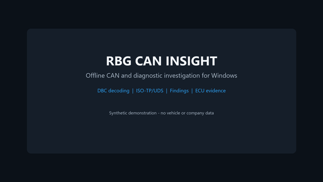
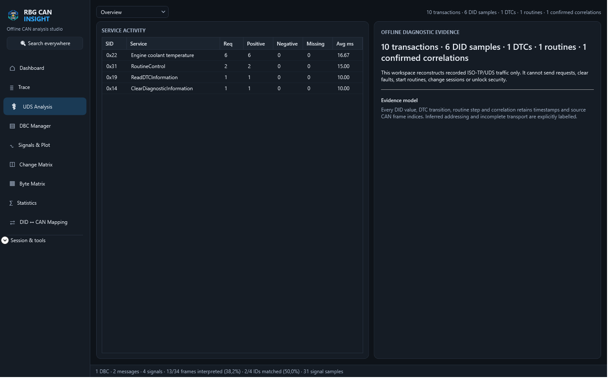
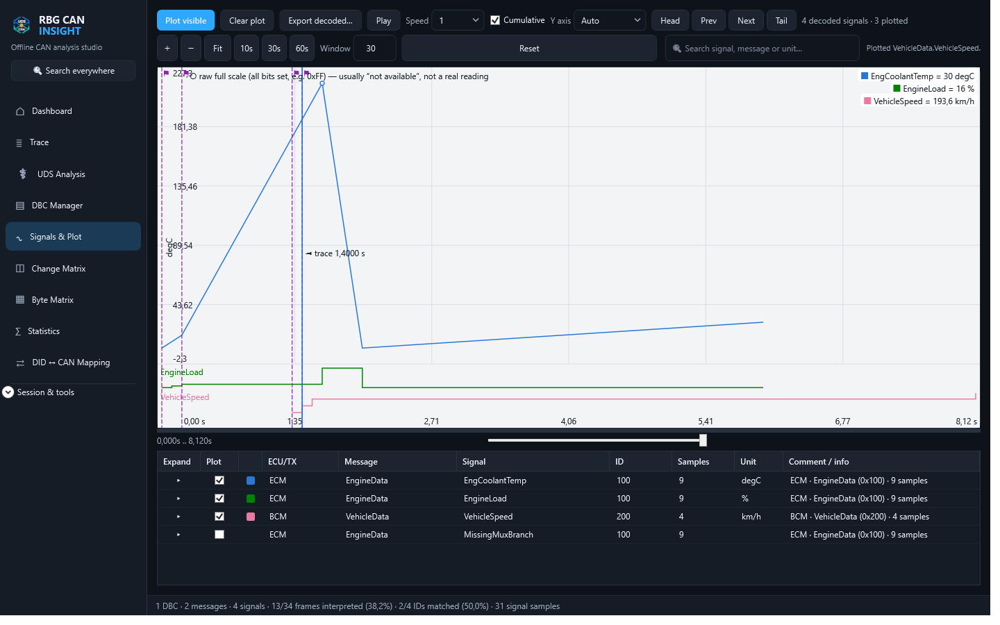
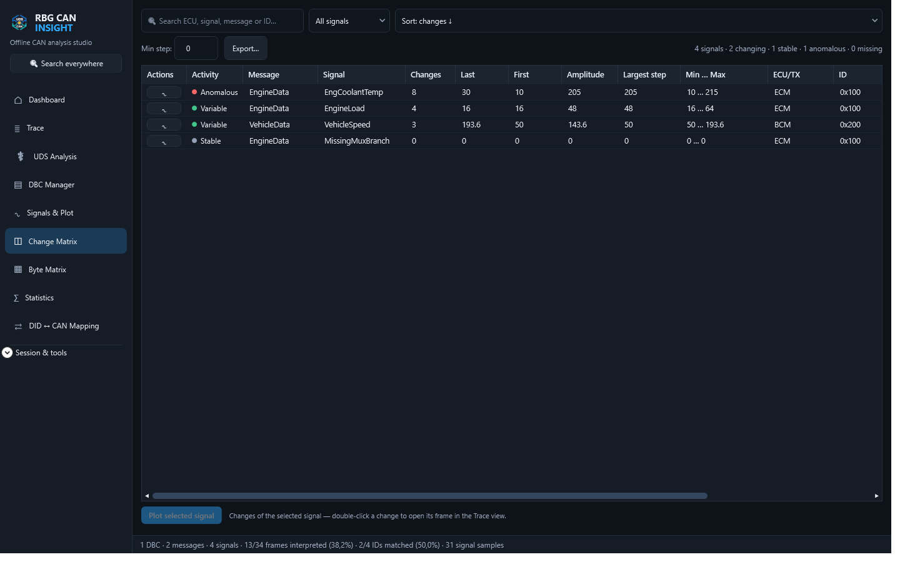
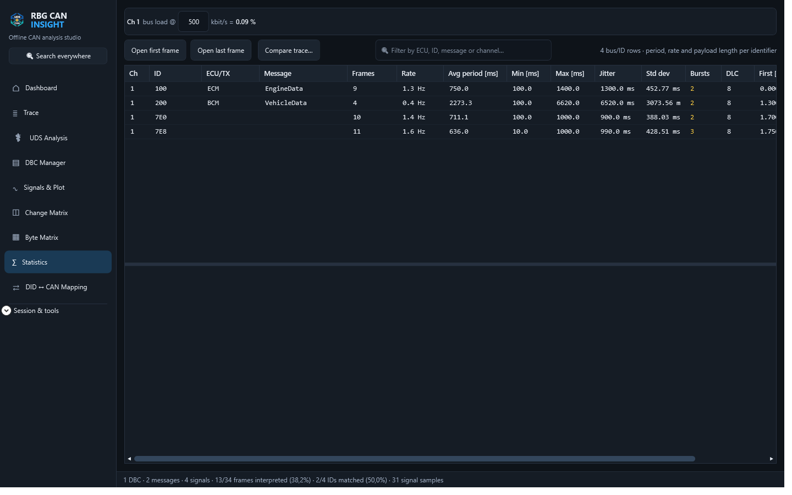

# RBG CAN Insight Demo

RBG CAN Insight is a Windows desktop application for local, offline analysis of recorded CAN traffic.

It imports common trace formats, decodes messages and signals with DBC databases, reconstructs ISO-TP/UDS activity, plots signal timelines, highlights changes and calculates per-identifier statistics. It does not connect to vehicles, transmit CAN frames or perform diagnostic programming.

[Try RBG CAN Insight on Microsoft Store](https://apps.microsoft.com/detail/9NTZXFCKR81D?cid=github-demo-2026q3)

The Store product is paid (EUR 19.99) and includes a free trial. The application interface is in English.

[Watch the 67-second high-resolution application demo on YouTube](https://youtu.be/p0MefQX73b0), [watch the 59-second Short](https://youtube.com/shorts/7IUpF-O9zg8), or [download the extended demo kit release](https://github.com/Ruba94-cyber/RBG-CAN-Insight-Demo/releases/tag/demo-v1.1).

## What you can inspect

- Vector ASC and BLF, PCAN TRC, CSV, candump LOG/TXT and MDF4/MF4 traces
- DBC message and signal decoding
- ISO-TP reconstruction and UDS request/response analysis
- DIDs, DTC activity, routines and negative responses found in recordings
- Signal plots with separate scales for different physical units
- Change Matrix, Byte Matrix, timing statistics and estimated bus load
- Offline DID-to-CAN correlation using CDD/ODX descriptions

## Synthetic demo

The files in [`samples`](samples/) are artificial and are not derived from a vehicle, manufacturer, employer or customer. The trace contains 3,867 frames over 60 seconds; the DBC defines 5 messages and 18 signals:

- `synthetic-drive.asc`: recorded-style CAN and UDS frames with repeated diagnostic activity
- `synthetic-demo.dbc`: matching powertrain, vehicle, chassis and thermal signal definitions

To try the workflow:

1. Install or start the free trial from Microsoft Store.
2. Open `samples/synthetic-drive.asc`.
3. Load `samples/synthetic-demo.dbc`.
4. Inspect **UDS Analysis**, **Signals & Plot**, **Change Matrix** and **Statistics**.

## Screenshots

### Recorded UDS evidence

### Mixed-unit signal plotting

### Signal change analysis

### Timing and bus-load statistics

## Privacy and safety

RBG CAN Insight processes user-selected files locally. It does not intentionally upload traces, databases, reports or projects. See the [privacy policy](PRIVACY.md).

The screenshots and sample files in this repository contain synthetic data only. Product names and protocol names are used descriptively; no affiliation with a vehicle manufacturer or tool vendor is claimed.

## Support and feedback

Use this repository's Issues section for reproducible bug reports and feature requests. Do not attach confidential, proprietary or personally identifiable trace data.

## License for this demo material

The synthetic samples and documentation in this repository are available under the [MIT License](LICENSE). This license does not apply to the commercial RBG CAN Insight application.
